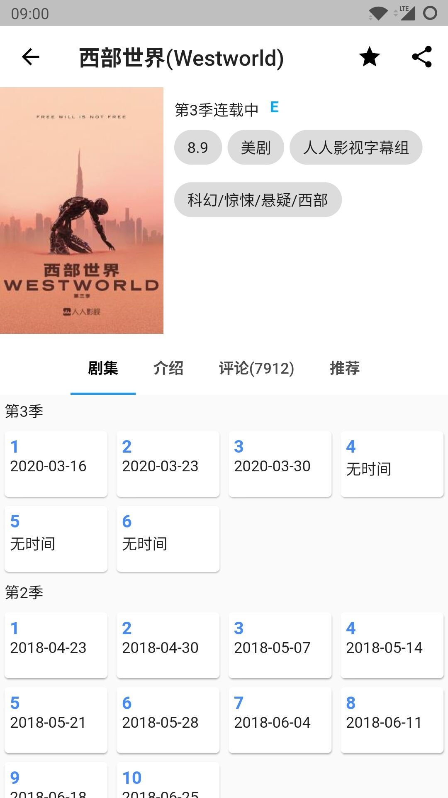
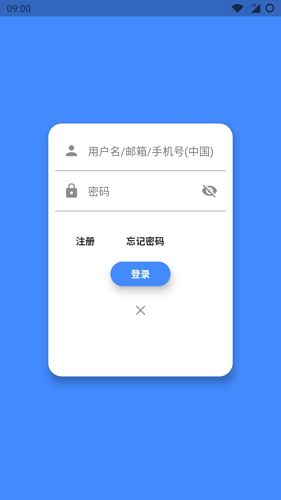
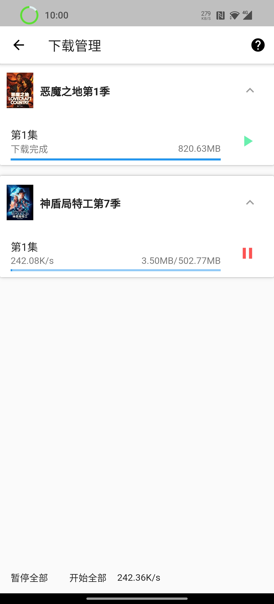

# 人人影视客户端 for Flutter

- [功能一览](#功能一览)
- [效果展示](#效果展示)
- [说明](#说明)
- [Build](#build)
- [Release](#release)


### 功能一览

- 安卓端边下边播
- 自动适应DarkMode
- 本地播放
- 我的收藏
- 影视搜索
- 用户登录

### 效果展示

**[Web端体验](http://vove.gitee.io/yyets_flutter_web_demo)**

若github不显示图片，请转[码云/yyets_flutter](https://gitee.com/Vove/yyets_flutter)

<div>
  </div>

<div>
  </div>

<div>
  </div>
<div></div>

### 说明

- **仅供学习交流使用**
- 支持全平台：Android, IOS, Windows, MAC OS, Web Server.
- 构建请参考Flutter官方文档。
- 目前仅支持安卓端边下边播，其他端仅支持其他方式下载。
- 关于Dart文件命名规范lowercase_with_underscores，后期会修改。
- 某些布局代码需要提取优化。
- 安卓打包请在`android/local.properties`中配置签名文件信息: `keyPath`, `keyAlias`, `keyPassword`, `storePassword`>
```properties
keyPath=F:\\..\\..
keyAlias=...
keyPassword=...
storePassword=...
```

### Build

环境：
```
❯ flutter doctor
Doctor summary (to see all details, run flutter doctor -v):
[√] Flutter (Channel master, v1.18.0-5.0.pre.35, on Microsoft Windows [Version 10.0.19613.1000], locale zh-CN)

[√] Android toolchain - develop for Android devices (Android SDK version 29.0.2)
[√] Chrome - develop for the web
[√] Visual Studio - develop for Windows (Visual Studio Community 2019 16.5.3)
[√] Android Studio (version 3.6)
[√] VS Code, 64-bit edition (version 1.44.2)
[√] Connected device (4 available)
```

- Android

```shell script
flutter build apk
```
build output dir: `build/app/outputs/apk/release/app-release.apk`

- IOS

```shell script
flutter build ios
```

- Windows

```shell script
flutter build windows
```
build output dir: `build/windows/x64/Release/Runner`

- Web

```shell script
flutter build web
```
build output dir: `build/web`

web 发布：可以将 web 目录下文件直接静态发布，你可以放到自己服务器，或者使用 [Github Pages](https://pages.github.com/) 和 [Gitee Pages](https://gitee.com/help/articles/4136#article-header0) 来发布。


### Release

安装包: [Releases](https://gitee.com/Vove/yyets_flutter/releases)

### TODO

- 注册
- 首页资讯
- 评分
- 按类型搜索
- 下载管理按剧折叠
